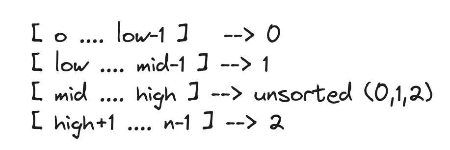

### Dutch National Flag Algo (sort 0s,1s,2s) :

The Dutch National Flag Algorithm is an efficient sorting algorithm that solves the problem of sorting an array of 0s, 1s, and 2s in linear time with constant space. 

The algorithm uses three pointers:

**low**: Tracks the boundary between 0s and 1s.
**mid**: Traverses the array, classifying elements.
**high**: Tracks the boundary between 1s and 2s.

*Image from [Medium](https://miro.medium.com/v2/resize:fit:1100/format:webp/1*aiDZTMR1pvBieO1ipIwltA.png)*

**Dry Run**:
[Refer in medium](https://medium.com/@abhishekrajavpy/dutch-national-flag-algorithm-e79d6d579766) 

**Time complexity**: O(n) where n is the number of elements in the array, as each element is processed at most once.
**Space complexity**: O(1) because sorting is done in-place.

